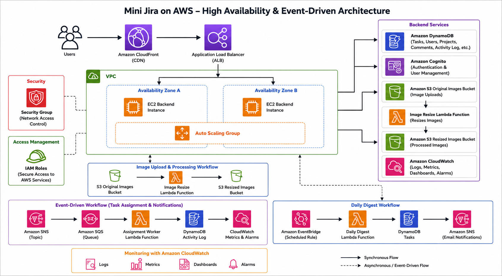

# Mini Jira AWS Architecture

## Overview

The Mini Jira system is a lightweight task-management application hosted fully on AWS.

The system supports:
- Managers
- Employees
- Teams
- Projects
- Tasks
- Comments
- Image uploads
- Notifications
- Monitoring

The architecture is designed using scalable AWS cloud services and event-driven processing.

---

## Architecture Diagram

---

# Main Architecture Flow

User → CloudFront → Application Load Balancer → EC2 Backend → AWS Services

The backend communicates with:
- DynamoDB
- S3
- Lambda
- SNS
- SQS
- CloudWatch
- Cognito

---

# AWS Services Used

## CloudFront

Purpose:
- Acts as CDN
- Improves performance
- Delivers frontend faster

---

## Application Load Balancer (ALB)

Purpose:
- Distributes traffic
- Performs health checks
- Routes incoming requests to backend services

Current status:
- Active

---

## EC2

Purpose:
- Hosts backend Node.js application
- Runs API routes and business logic

Current status:
- Backend deployment setup prepared
- No EC2 instances currently running

---

## DynamoDB

Purpose:
- Stores all project data

Tables:
- mini-jira-users
- mini-jira-teams
- mini-jira-projects
- mini-jira-tasks
- mini-jira-comments
- mini-jira-activity-log

Indexes:
- teamId
- assigneeId

---

## S3

Purpose:
- Stores uploaded task images
- Keeps image versions

Buckets:
- mini-jira-original-images1
- mini-jira-resized-images1

---

## Lambda Functions

### Image Resize Lambda

Triggered when:
- New image uploaded to S3

Purpose:
- Creates resized thumbnails

Function:
- MiniJiraImageResizer

---

### Assignment Worker Lambda

Triggered by:
- SQS queue

Purpose:
- Writes activity logs
- Publishes CloudWatch metrics

Function:
- mini-jira-assignment-worker

---

### Daily Worker Lambda

Purpose:
- Handles scheduled background processing

Function:
- mini-jira-daily-worker

---

### Daily Digest Lambda

Triggered by:
- EventBridge scheduled rule

Purpose:
- Sends daily task reminder emails

Function:
- mini-jira-daily-digest

---

## SNS

Purpose:
- Sends task assignment notifications
- Sends digest emails

---

## SQS

Purpose:
- Buffers assignment events
- Decouples backend from background processing

---

## EventBridge

Purpose:
- Runs scheduled daily digest Lambda every day

---

## Cognito

Purpose:
- Handles authentication
- Manages users and roles

Configured resource:
- mini-jira-app-client

---

## CloudWatch

Purpose:
- Monitoring
- Logging
- Metrics
- Alarms

Monitoring includes:
- Dashboard widgets
- Task activity metrics
- Assignment worker monitoring
- SQS alarm monitoring

---

# Security

IAM roles and policies are used with least-privilege access.

Lambda IAM roles are configured for:
- S3 access
- CloudWatch metrics
- SQS processing

Backend EC2 IAM role deployment is still pending.

---

# Team Isolation

Employees can only access tasks belonging to their own team.

Filtering is enforced on the backend server side using:
- teamId
- DynamoDB Global Secondary Indexes

Managers can access all teams and tasks.

---

# Scalability and Reliability

The architecture uses:
- Application Load Balancer
- CloudFront CDN
- Serverless Lambda processing
- Event-driven architecture using SNS and SQS

to improve scalability and reliability.